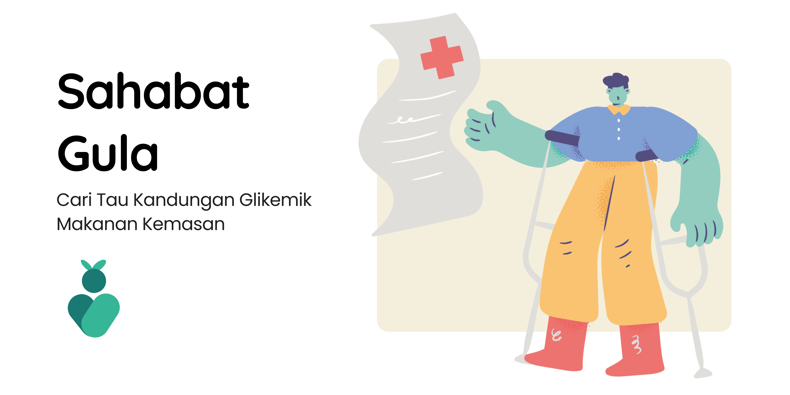

<p align="center">
	
</p>

# Sahabat Gula API

Sahabat Gula backend API created for Sahabat Gula app as a Capstone Project from Bangkit 2024.

Sahabat Gula API handle the request of registration, email verification, user customization, nutrition computation, and much more!

 <br /><br />

## Status

This project is under development, but we will do our best to keep things stable.

## Usage

You can use our latest commercial API deployment in
[sahabat-gula-dev.us.to](https://sahabat-gula-dev.us.to).

## Deploying Yourself

### Prerequisites

Before running, make sure you have:

1. [Bun](https://bun.sh) installed.
2. Google Cloud Platform (GCP) project with Firestore enabled.
3. GCP Service Account key file.

You need to also create `.env` file with the following variables:

```env
GCP_PROJECT_ID="your-project-id"
GCP_SA_KEY="path/to/your/service-account-key.json"
```

### Building

You need to install all the dependencies first:

```bash
bun install
```

To start the API, you can run

```bash
bun start
```

While this is usually sufficient, you can also bundle the code to reduce startup and improve running performance:

```bash
bun run build
```

Then, to start from bundle, you can run:

```bash
bun run start:prod
```

### Testing

The code is tested using Bun native test library. To run the test, you can do:

```
bun test
```

More test will be created later on.
